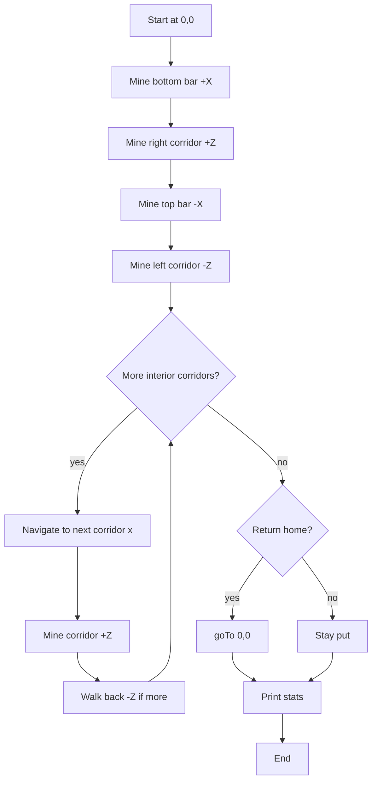

# Strip Miner (symmetric grid, 1x2 height)

This document describes the algorithm implemented by `strip_miner.lua` for **symmetric grid mining** with **3-block rock gaps** and **1x2 corridor height**, plus end-of-run statistics (moves/turns/fuel/time).

## Goals

- Mine a **symmetric rectangular grid** of parallel corridors.
- Keep **3 blocks of rock** between corridors so a player can run and scan for ores.
- Maintain a **1-wide by 2-tall** tunnel profile.
- Both ends of the grid are connected (easy navigation).
- Handle inventory pressure according to `fullMode`.
- Stay safe on fuel by ensuring enough to return home.

## Coordinate model (internal)

The program maintains a simple relative coordinate system:

- Start position: `(x=0, y=0, z=0)`
- Facing direction `dir`:
  - `0`: +Z
  - `1`: +X
  - `2`: -Z
  - `3`: -X

Every successful `turtle.forward()` increments the corresponding axis. Vertical moves adjust `y`.

## High-level algorithm

1. Show a pre-prompt hint about odd/even corridor counts.
2. Read parameters (`corridorLength`, `corridorCount`, `gap`, `mineRight`, `showLogs`, `enableTorches`, `torchInterval`, `fuelReserve`, `invThreshold`, `enableOreMining`, `enablePokeholes`, `pokeholeInterval`, `returnHome`, `fullMode`).
3. Show efficiency tips based on corridor count (odd vs even, repositioning moves).
4. Estimate required fuel and call `fuel.ensureFuel(...)`.
5. **Phase 1**: Mine the perimeter rectangle (bottom bar → far corridor → top bar → near corridor).
6. **Phase 2**: Fill in interior corridors by branching off the bars.
7. Optionally return to start.
8. Print statistics (time, moves, turns, fuel used).

## Inputs

- `corridorLength`: Length of each corridor.
- `corridorCount`: Number of parallel corridors.
- `gap`: Rock gap between corridors.
- `mineRight`: Expand to the right (+X) or left (-X).
- `showLogs`: Log output vs live status screen.
- `useDefaults`: Use default sizing and settings (30 length, 10 corridors).
- `enableTorches` + `torchInterval`: Place torches every N blocks.
- `fuelReserve`: Minimum fuel buffer above distance home.
- `invThreshold`: Return when empty slots are at or below this number.
- `enableOreMining`: Mine connected ore veins.
- `enablePokeholes` + `pokeholeInterval`: Side holes every N blocks.
- `returnHome`: Return to start when complete.
- `fullMode`: Inventory handling (pause, chest + resume, or drop junk only).

## Direction option

The `mineRight` parameter controls which way the grid expands:
- `true` (default): Mine to the **right** (+X direction)
- `false`: Mine to the **left** (-X direction)

This allows you to position the turtle on either side of an existing mine.

## Status screen

If `showLogs` is `false`, the script suppresses log output and shows a live status screen that updates during mining (progress, position, fuel, moves, turns, torches, empty slots, elapsed time).

## Efficiency guidance

When you enter the number of corridors, the script shows:
- **Odd corridor counts (3, 5, 7...)**: You end at a middle interior corridor, so return home is shorter on average.
- **Even corridor counts (4, 6, 8...)**: You end at the farther edge, so return home is longer.
- **Repositioning moves**: The script calculates how many moves will be spent walking back through already-mined corridors between interior corridor digs.

## Symmetric grid pattern

The turtle mines a clean rectangular outline first, then fills in the middle corridors:

```
Phase 1 (perimeter):
     x: 0 1 2 3 4 5 6 7 8
z=10:  ■ ■ ■ ■ ■ ■ ■ ■ ■   <- top bar
       ■               ■
       ■               ■   <- left + right corridors
       ■               ■
z=0:   ■ ■ ■ ■ ■ ■ ■ ■ ■   <- bottom bar (start here)

Phase 2 (interior):
     x: 0 1 2 3 4 5 6 7 8
z=10:  ■ ■ ■ ■ ■ ■ ■ ■ ■
       ■       ■       ■
       ■       ■       ■   <- middle corridor at x=4
       ■       ■       ■
z=0:   ■ ■ ■ ■ ■ ■ ■ ■ ■
```

This creates a **fully connected symmetric grid** that's easy for a player to navigate.

## 1x2 height clearing

Each forward move clears a 2-high column:

1. Mine forward one block.
2. Clear the block above.
3. Move forward into the new space.

This creates a 1-wide, 2-tall corridor without changing the horizontal path.

## Inventory handling (`fullMode`)

When inventory reaches the empty-slot threshold:

- Always try `dropJunk()` first (fuel stays in slot 15, torches stay in slot 16).
- If still full:
  - `1`: Pause and wait for user.
  - `2`: Return to chest at start, dump, then resume at previous location.
  - `3`: Continue anyway (risk: missing drops).

## Fuel handling

- At startup: `fuel.ensureFuel(estimatedMoves + fuelReserve)`.
- During mining: auto-refuel from inventory to maintain `fuelReserve` above the distance home.
- If still low, return home to restock and resume; if return-home is disabled, stop with a warning.
- If supplies are missing at the chest, the turtle waits for the user to restock.

## Return home and deposit

- If `returnHome` is enabled and the turtle can return safely, it returns to the start and dumps remaining inventory into the chest behind the turtle.

## Torch handling

- If enabled, the turtle places torches every `torchInterval` blocks.
- When out of torches, it returns home to restock (or waits at the chest if still empty).

## Ore mining

- If enabled, the turtle checks adjacent blocks and mines connected ore veins.
- Uses a standard overworld ore list (coal, copper, iron, gold, redstone, lapis, diamond, emerald + deepslate variants).

## Pokeholes

- If enabled, every `pokeholeInterval` blocks the turtle digs one-block pokeholes left and right.
- It briefly steps into each hole to expose more ore faces, then returns to the main corridor.

## Statistics

The run prints:

- **Time**: wall-clock time measured via `os.epoch("utc")`.
- **Movements**: count of successful forward/up/down moves (including ore mining and pokeholes).
- **Turns**: count of left/right turns.
- **Fuel used**: `startFuel - endFuel` when fuel is finite.
- **Efficiency**: blocks per minute (based on the internal progress counter).

## Flow diagram (Mermaid)



## Final shape (top-down)

```
■■■■■■■■■   z=length (top bar)
■   ■   ■
■   ■   ■   interior corridors
■   ■   ■
■■■■■■■■■   z=0 (bottom bar + start)
x=0   x=4   x=8
```

## Notes / tuning suggestions

- `MAX_DIG_ATTEMPTS` controls how long the turtle retries around hard/temporary blocks.
- If the turtle often waits on `sleep(0.2)`, lowering sleep can speed mining, but increases CPU usage and can spam dig attempts.
- If you want maximum speed, consider an option to skip `turtle.suck()` calls (or only suck periodically) — that reduces API calls but can leave drops behind.
